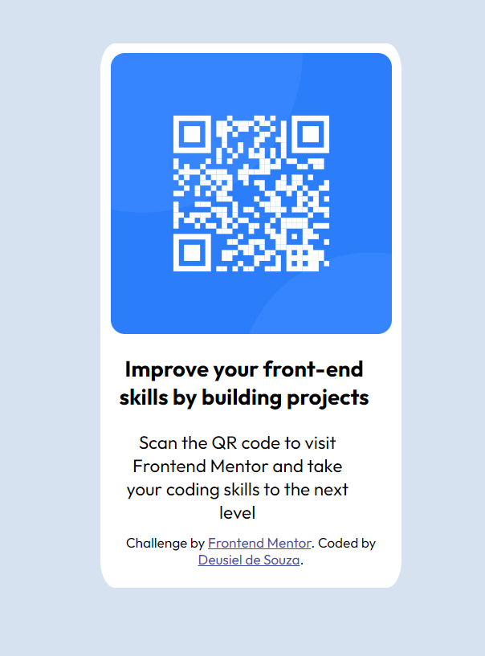

# Frontend Mentor - QR code component solution

This is a solution to the [QR code component challenge on Frontend Mentor](https://www.frontendmentor.io/challenges/qr-code-component-iux_sIO_H). Frontend Mentor challenges help you improve your coding skills by building realistic projects. 

## Table of contents

- [Overview](#overview)
  - [Screenshot](#screenshot)
  - [Links](#links)
- [My process](#my-process)
  - [Built with](#built-with)
  - [What I learned](#what-i-learned)
  - [Continued development](#continued-development)
- [Author](#author)

**Note: Delete this note and update the table of contents based on what sections you keep.**

## Overview

### Screenshot

### Links

- Solution URL: [Add solution URL here](https://your-solution-url.com)
- Live Site URL: [live QR code Site](https://deusiel1.github.io/qr-code-component.io/)

## My process

### Built with

- Semantic HTML5 markup
- CSS variables
- Flexbox
- Mobile-first workflow

### What I learned

In this challenge I learned to declare `display: flex` twice. I didn't know that. I also used relative units instead of pixels wich helped with responsiveness.

### Continued development

I need to improve my ability to deal with units. At the beginning I sttrugled a litle because I was using percentages instead of rem's. After this change I was able to finish the project. I also didn't use any media queries because from my perspective it looks good on both mobiel and desktop version.

## Author

- Github - [desuiel1](https://github.com/deusiel1)
- Frontend Mentor - [@deusiel1](https://www.frontendmentor.io/profile/deusiel1)
- Twitter - [@DeusielS](https://twitter.com/DeusielS)

